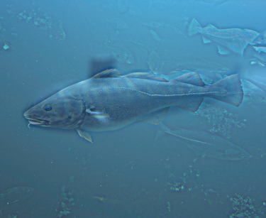

# CSC589: Intro to Computer Vision  :sparkles: :eyes: :sparkles:
A collection of problem sets for CSC-589: Intro to Computer Vision, taught by Professor Bei Xiao at
American University. Code is written in Python. Some of the libraries used are Numpy, Matplotlib,
OpenCV, and SciPy. These libraries were installed primarily through ```pip``` and ```brew```. :coffee:

## Problem Set 1
This problem set focuses on exploring the various capabilities of the libraries that we will utilize throughout
the semester, as well as to gain an understanding of matrices arithmetic.

## Problem Set 2
This problem set challenged me to think a bit outside the box. Here you will find examples of histogram
equalization, an amateur edge detection sobel filter, separable filters, and so on.

## Problem Set 3 / Project 1
This project involved creating convlution functions, gaussian kernels, and high/low-pass functions
to create hybrid images. Check out the example at the bottom: 




## Problem Set 4 / Project 2
This project involved creating convlution functions, gaussian kernels, and high/low-pass functions
to create hybrid images. Check out the example at the bottom: 


